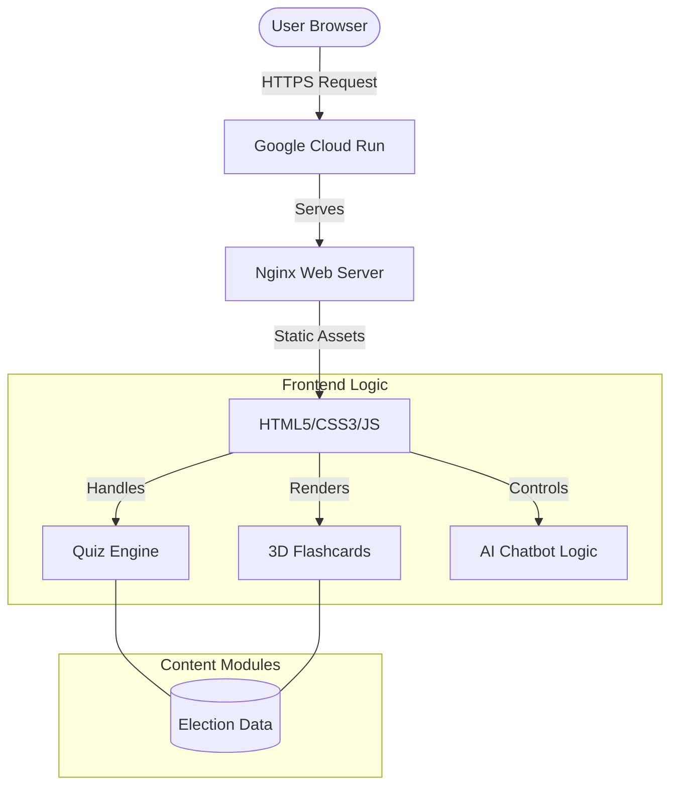

# 🗳️ DemocracyGuide: Indian Election Interactive Assistant

A premium, interactive web application designed to educate citizens about the Indian electoral process through immersive visuals, 3D components, and AI-driven interactions.

## 🚀 Live Demo
**[View the Live App Here](https://election-assistant-382911730737.us-central1.run.app)**

---

## ✨ Features

- **Interactive Election Cycle**: A visual walkthrough of the 8-step election process in India.
- **3D Flashcards**: Immersive 3D-flip cards covering key terminology like EVM, VVPAT, NOTA, and MCC.
- **Knowledge Quiz**: An interactive, logic-based quiz to test your understanding of the election system.
- **AI Chatbot**: A persistent floating assistant to answer queries about voter registration and election rules.
- **Premium Design**: Modern Glassmorphism aesthetic with vibrant gradients and smooth micro-animations.
- **Mobile Responsive**: Fully optimized for desktops, tablets, and smartphones.

---

## 🏗️ Architecture & Flow



---

## 🛠️ Technology Stack

- **Frontend**: Vanilla HTML5, CSS3 (Modern Flexbox/Grid), JavaScript (ES6+).
- **Design System**: Custom Glassmorphism UI with CSS Variables.
- **Containerization**: Docker (Alpine-based Nginx).
- **Cloud Infrastructure**: Google Cloud Platform (Cloud Run, Cloud Build, Artifact Registry).
- **Version Control**: Git & GitHub.

---

## 📦 Deployment Guide

The project is containerized using Docker and deployed via Google Cloud Run.

### Local Development
1. Clone the repository.
2. Open `index.html` in any modern browser.

### Cloud Deployment (Google Cloud Run)
```bash
# Build and deploy directly from source
gcloud run deploy election-assistant --source . --region us-central1 --allow-unauthenticated
```

---

## 📝 License
This project is for educational purposes to increase awareness about the Indian Democratic process.

---
*Created with ❤️ for Democracy.*
